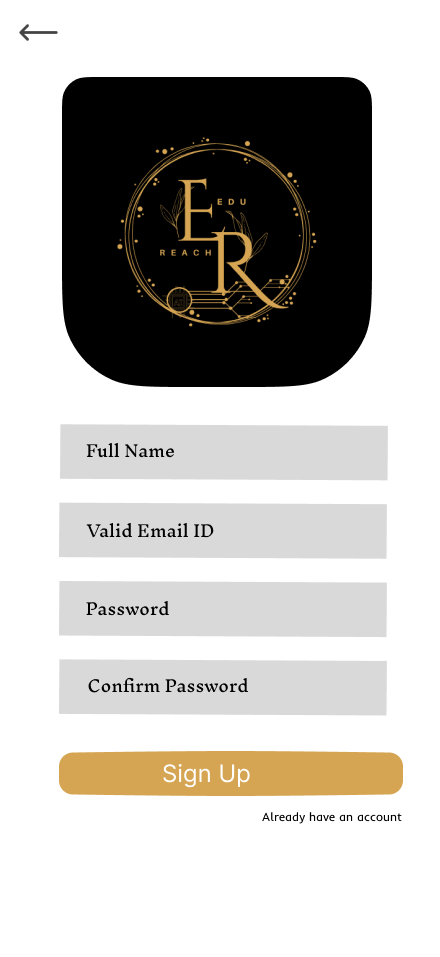
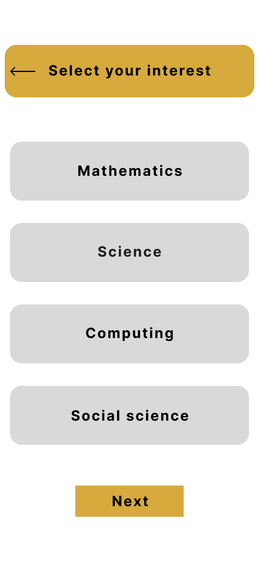
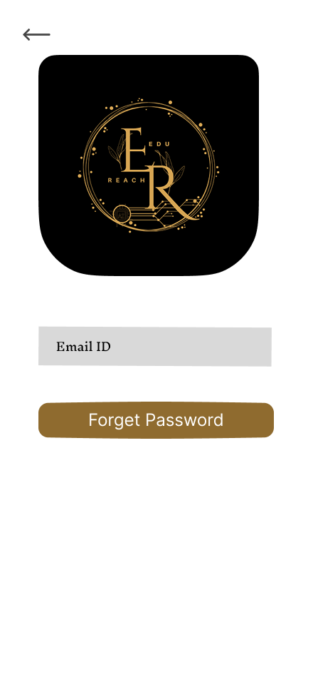
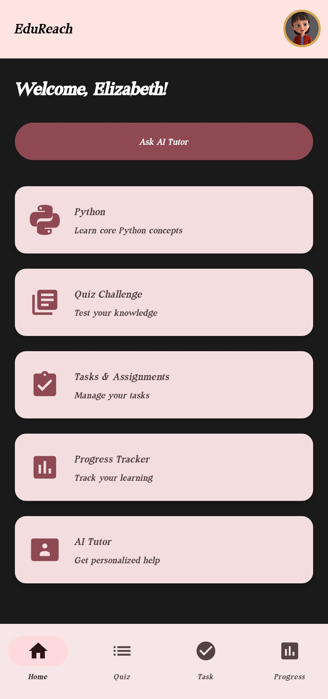
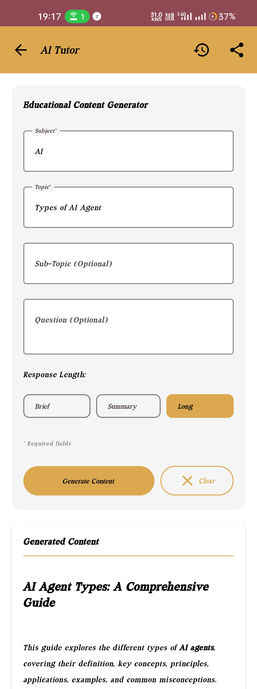
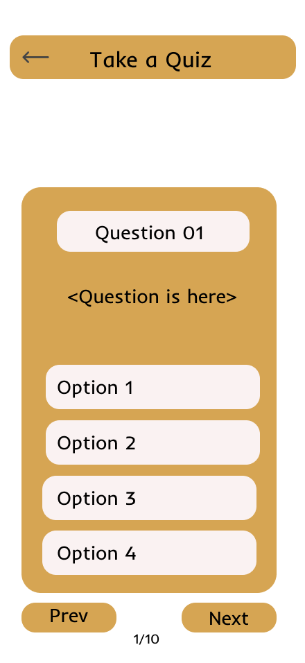
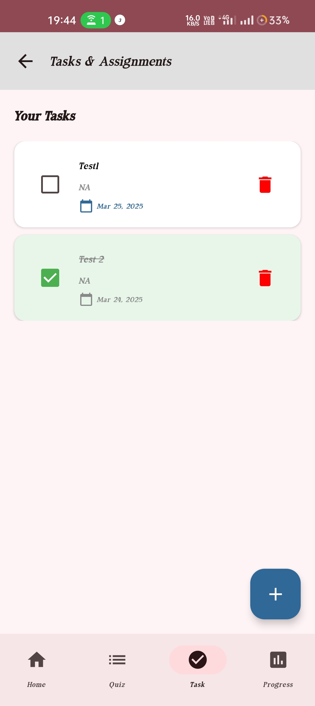
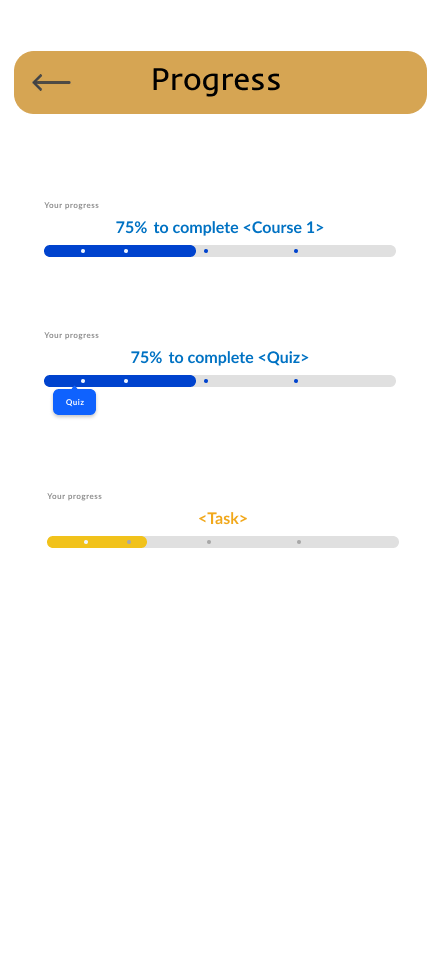

# 📚 EduReach – AI-Powered Learning Companion  

EduReach is an AI-powered educational app designed to enhance learning efficiency through interactive courses, quizzes, task management, and personalized progress tracking. Whether you're a student or a lifelong learner, EduReach provides a structured way to improve your skills and knowledge.

## 🚀 Features  

✅ **AI Tutor** – Get instant topic summaries and best learning resources.  
✅ **Interactive Quizzes** – Test your knowledge with engaging quizzes.  
✅ **Task Management** – Organize and track your learning tasks efficiently.  
✅ **Progress Tracking** – Monitor your learning journey with visual progress bars.  
✅ **Course Selection** – Choose from multiple subjects like AI, Python, Science, and more.  
✅ **User Profile** – Customize your learning experience with a personal profile.  

---

## 🛠 Tech Stack  

- **Frontend:** Jetpack Compose (Android UI)  
- **Backend:** Firebase   
- **AI Integration:** Google Dialogflow (for AI tutor)  
- **API Integration:** For fetching courses  
- **Database:** Firestore / SQLite
- **Development Assistance:** Gemini Code Assist (Used for faster and optimized coding)

---

## 📷 Screenshots  
| Welcome | Registration | Interest | Login | Forget Password | Profile |
|------|--------|---------|------|------|---------|
|  |  |  |  |  |  |

| Home | Courses | AI Tutor | Quiz | Task | Progress |
|------|--------|---------|------|------|---------|
|  |  |  |  |  |  |

---

## 🏗 Installation (Installation guide will be updated after project approval)  


---

## 💡 How to Contribute  

1. **Fork the repository** 🍴  
2. **Create a new branch** 🌿  
   ```bash
   git checkout -b feature-branch
   ```
3. **Make your changes** 🛠  
4. **Commit the changes** ✅  
   ```bash
   git commit -m "Added new feature"
   ```
5. **Push to GitHub** 🚀  
   ```bash
   git push origin feature-branch
   ```
6. **Create a Pull Request** 🔥  

---

## 🎖 Developed by Team Knights  
EduReach is proudly developed by **Team Knights**, a passionate group of developers dedicated to building innovative educational solutions.  

💡 Join us in shaping the future of AI-driven learning!  

## 👥 Team Members (Team Knights)  
- **Abhishek Maurya** – Project Lead & Android Developer  + AI Integration & Backend Developer
- **Shivank Rastogi** – UI/UX Designer  
- **Kumar Manglam** – Firebase & Database Manager  

---

## 📜 License  
This project is **open-source** and available under the [**MIT License**](LICENSE).  

---

## 💬 Connect With Me  
📧 Email: maurya972137@gmail.com  
🔗 [GitHub](https://github.com/abhishek-maurya576) | [LinkedIn](https://www.linkedin.com/in/abhishekmaurya9118) | [YouTube](https://youtube.com/@bforbca)  

👨‍💻 Feel free to explore, contribute, and enhance the EduReach experience! 🚀  

